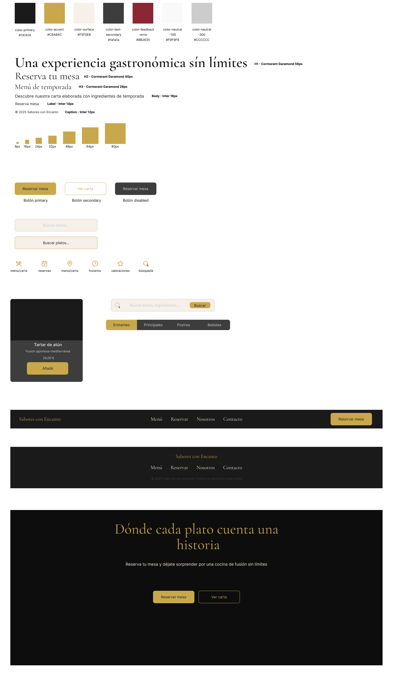
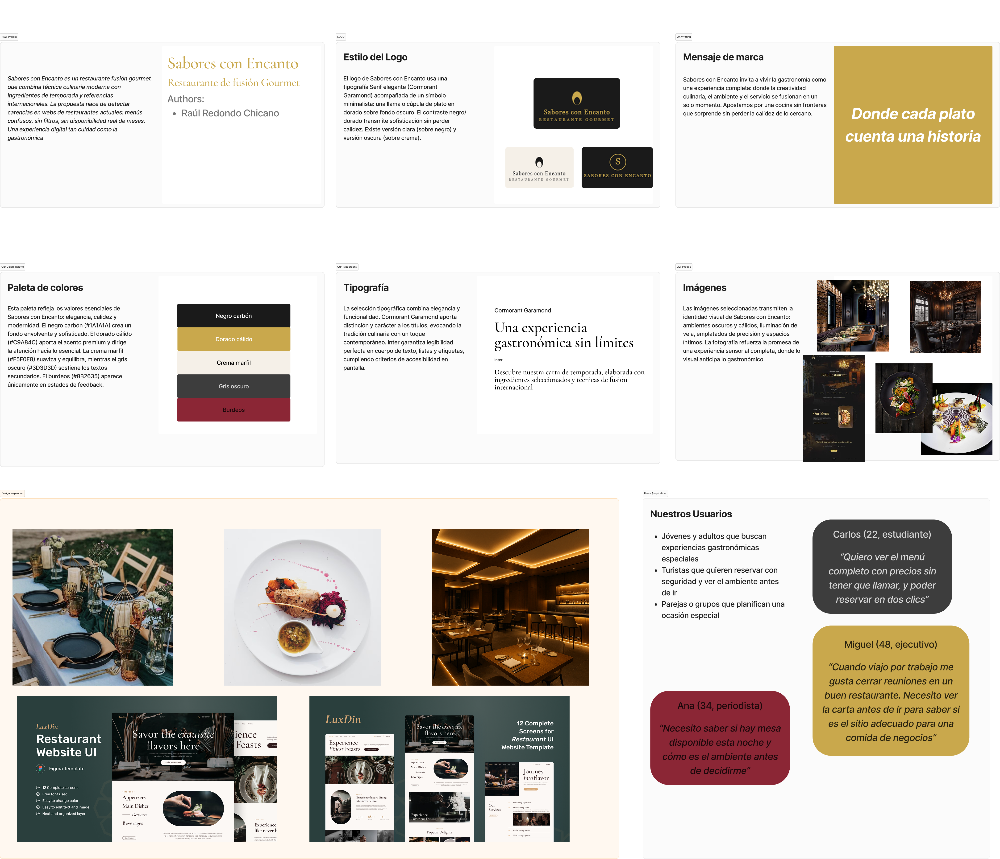
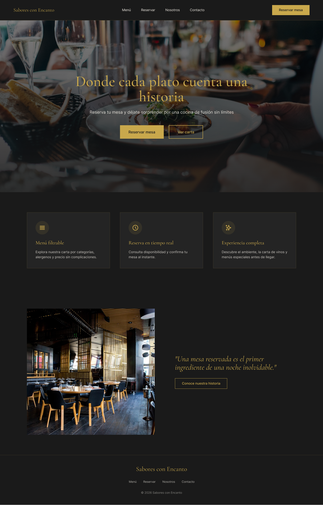
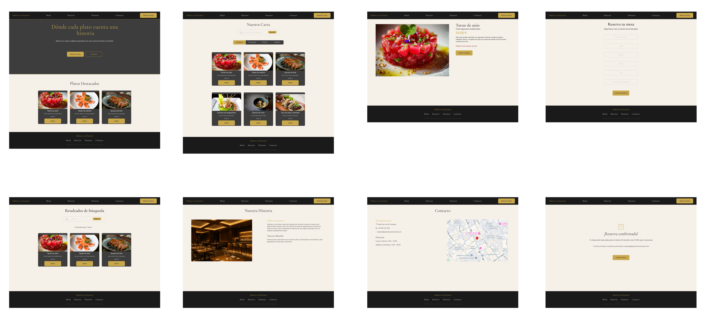

# DIU26
Prácticas Diseño Interfaces de Usuario - Sabores con Encanto

[Guiones de prácticas](./GuionesPracticas/)

Actualizado: 23/05/2026

---

## 🔗 Enlaces del proyecto

| Recurso | Enlace |
|--------|--------|
| 🎨 Figma (P3) | [Ver diseño](https://www.figma.com/design/kh3VvDpBz8eGqK6z3bIJjP/p3) |
| 🌐 Web publicada (P4) | [sabores-con-encanto.surge.sh](https://sabores-con-encanto.surge.sh) |
| 💻 Código fuente (P4) | [Ver en GitHub](https://github.com/Rauliitoo4/UX_CaseStudy/tree/master/P4) |

---

## Paso 0. My UX-Case Study

Grupo: DIU3.rrc. Curso: 2025/26

**Nombre del Proyecto:** Sabores con Encanto

**Descripción:** Sabores con Encanto es un restaurante de fusión gourmet que combina técnicas culinarias de distintas culturas con ingredientes de temporada. La propuesta digital permite explorar la carta, reservar mesa en tiempo real y descubrir la filosofía del restaurante de forma sencilla e inmersiva.

**Logotipo:**

**Slogan:** *Donde cada plato cuenta una historia*

**Miembros:**

👤 Raúl Redondo Chicano [:octocat:](https://github.com/Rauliitoo4)

---

## Proceso de Diseño

## Paso 1. UX User & Desk Research & Análisis

### 1.a User Research Plan

El contexto analizado es el sector de la hostelería gourmet y la experiencia gastronómica en Granada. El objetivo es entender cómo los usuarios buscan, evalúan y reservan en restaurantes online. La estrategia combina análisis de la competencia, definición de perfiles de usuario y revisión experta de usabilidad sobre webs existentes del sector. Se priorizan usuarios con distintos niveles tecnológicos y motivaciones de visita (ocio, trabajo, ocasiones especiales).

### 1.b Competitive Analysis

Se analizaron tres competidores del sector fast food y burger gourmet: **Goiko**, **The Champions Burger** y **Five Guys**. Se seleccionó **Goiko** como caso principal de estudio por ser la propuesta más completa digitalmente, con carta online, sistema de reservas y presencia mobile. Sus puntos fuertes son el diseño visual y la claridad de los CTAs, mientras que sus debilidades principales son la falta de buscador avanzado, filtros en la carta y mapa del sitio.

### 1.c Personas

**Carlos (22, estudiante):** Busca restaurantes con buen ambiente y precios visibles. Quiere ver el menú completo y poder reservar en pocos pasos sin tener que llamar.

**Miguel (48, ejecutivo):** Viaja frecuentemente por trabajo y necesita cerrar reuniones en restaurantes adecuados. Valora conocer la carta y el ambiente antes de ir para asegurarse de que es un sitio apropiado para una comida de negocios.

**Ana (34, periodista):** Busca disponibilidad de mesa para esta noche y quiere saber cómo es el ambiente del restaurante antes de tomar la decisión.

### 1.d User Journey Map

Se definieron dos journey maps: el de Carlos, que intenta reservar mesa desde el móvil en el último momento y se encuentra con dificultades para confirmar disponibilidad en tiempo real; y el de Miguel, que investiga el restaurante desde el ordenador antes de una reunión y necesita información clara sobre la carta y el ambiente.

### 1.e Usability Review

Enlace al documento: [Usability-review.xlsx](./P1/Usability-review.xlsx)

URL analizada: [goiko.com](https://www.goiko.com/es/carta/hamburguesas/)

**Valoración obtenida: 75.83 / 100 — Buena**

La web de Goiko ofrece una experiencia visualmente atractiva y con buena arquitectura de navegación. Sus puntos fuertes son la claridad de los CTAs, el rendimiento técnico y la legibilidad del contenido. Las debilidades más destacadas son la ausencia de un buscador avanzado con filtros, la falta de mapa del sitio y la escasa ayuda contextual en los formularios, aspectos que afectan especialmente a usuarios con menor experiencia digital.

---

## Paso 2. UX Design

### 2.a Reframing / Ideación

A partir del análisis de Goiko y las experiencias de los usuarios ficticios, se identificaron las carencias principales del sector: falta de filtros en la carta, ausencia de reservas en tiempo real y experiencia mobile poco optimizada. La propuesta de valor de Sabores con Encanto se centra en resolver estas fricciones ofreciendo una experiencia digital completa, elegante y sin complicaciones.

**Feedback Capture Grid:**

| Interesante | Críticas |
|-------------|----------|
| Diseño visual atractivo en competidores | Sin filtros ni buscador en la carta |
| CTAs claros para añadir al carrito | Reservas poco visibles o inexistentes |
| **Preguntas** | **Nuevas ideas** |
| ¿Puedo ver disponibilidad antes de reservar? | Reserva en tiempo real con confirmación inmediata |
| ¿Hay platos sin gluten o vegetarianos? | Carta filtrable por categoría, alérgenos y precio |

### 2.b ScopeCanvas

La propuesta se articula en tres pilares: **menú filtrable** (por categoría, alérgenos y precio), **reserva en tiempo real** (con confirmación inmediata) y **experiencia visual inmersiva** que transmita la identidad gourmet del restaurante. El objetivo es fidelizar tanto a usuarios jóvenes que valoran la autonomía digital como a perfiles profesionales que necesitan información clara y rápida.

### 2.c User Flow / Task Analysis

Se definieron dos flujos principales:

- **Consulta de carta:** Inicio → Menú → Filtro por categoría → Detalle de plato → Añadir
- **Reserva de mesa:** Inicio → Reservar → Seleccionar fecha/hora/comensales → Confirmar → Confirmación

Además se elaboró una **User Task Matrix** identificando las tareas más frecuentes y su importancia para cada perfil de usuario.

### 2.d IA: Sitemap + Labelling

| Término | Significado | Icono |
|---------|-------------|-------|
| Menú | Carta de platos filtrable por categoría | UtensilsCrossed |
| Reservar | Formulario de reserva de mesa | Calendar |
| Nosotros | Historia y filosofía del restaurante | Info |
| Contacto | Información de contacto y localización | MapPin |
| Buscar | Búsqueda de platos por nombre | Search |

### 2.e Wireframes

Bocetos Lo-Fi diseñados en Figma para las vistas principales: Landing, Carta, Detalle de plato, Reserva, Búsqueda, Nuestra Historia, Contacto y Confirmación de reserva. Se realizó una primera versión con posiciones fijas y una segunda con grid layout responsive.

---

## Paso 3. Mi UX-Case Study (diseño)

### 3.a Moodboard

Guía de estilos visual creada en Figma con paleta de colores elegante (negro carbón `#2A2A2A`, dorado `#C9A84C`, crema marfil `#F5F0E8` y rojo vino `#8B0000`), tipografía **Cormorant Garamond** para transmitir sofisticación, e imágenes de alta calidad que reflejan la identidad gourmet del restaurante. El logotipo combina tipografía serif y un símbolo minimalista que evoca la gastronomía de autor.

### 3.b Landing Page

Landing page diseñada en Figma con hero de imagen a pantalla completa con overlay oscuro, headline impactante (*"Donde cada plato cuenta una historia"*), dos CTAs principales (Reservar mesa / Ver carta) y sección de platos destacados. Generada con apoyo de **Figma Make** y ajustada manualmente para mantener coherencia con el Design System.

### 3.c Guidelines

Patrones IU seleccionados: **Sticky navbar** para navegación persistente, **cards** para mostrar platos con imagen, nombre, descripción y precio, **filtros por categoría** en la carta, **formulario de reserva paso a paso** con indicador de progreso y **jerarquía visual de botones** (primary dorado / secondary outline / disabled gris).

### 3.d Mockup

Mockup Hi-Fi en Figma con 8 pantallas: Landing, Carta, Detalle de plato, Reserva, Resultados de búsqueda, Nuestra Historia, Contacto y Confirmación de reserva. Diseño con autolayout responsive y componentes con variantes para simular interacciones.

[Ver en Figma](https://www.figma.com/design/kh3VvDpBz8eGqK6z3bIJjP/p3)

---

## Paso 4. Pruebas de Evaluación

### 4.a Reclutamiento de usuarios

**Caso B asignado:** DIU2.AKA

| Usuarios | Sexo/Edad | Ocupación | Exp.TIC | Personalidad | Plataforma | Caso |
|----------|-----------|-----------|---------|--------------|------------|------|
| P01 | H / 22 | Estudiante | Media | Extrovertido | Web | A |
| P02 | M / 34 | Periodista | Media | Analítica | Web | A |
| P03 | H / 48 | Ejecutivo | Baja | Racional | Web | B |
| P04 | M / 26 | Diseñadora | Alta | Creativa | Web | B |

### 4.b Diseño de las pruebas

Se plantean tres pruebas principales por usuario: navegación libre por la landing (5 min), tarea de reserva de mesa y tarea de búsqueda de un plato concreto en la carta. Se registrará si el usuario necesitó ayuda para completar cada tarea. Duración aproximada: 5-10 minutos por sesión.

### 4.c Cuestionario SUS

Se utilizará el cuestionario SUS estándar de 10 preguntas mediante **Tally.so**, ampliado con preguntas demográficas. Los resultados se analizarán con **sus.mixality.de** para obtener la valoración numérica y la etiqueta lingüística de cada caso. Resultados en [P4/](./P4/).

### 4.d A/B Testing

Pendiente de completar tras realizar las pruebas con usuarios. Se comparará el Caso A (Sabores con Encanto) con el Caso B (DIU2.AKA) usando los resultados del cuestionario SUS y las métricas de Eye Tracking.

### 4.e Aplicación del método Eye Tracking

Se utilizará **GazeMapping** sobre capturas de pantalla de las páginas principales del Caso B (DIU2.AKA). Se definirán POIs en elementos clave: logo, CTA de reserva, navegación y cards de platos. Mínimo 3 usuarios. Resultados en [P4/](./P4/).

### 4.f Usability Report de B

Pendiente de completar. El informe evaluará el Caso B (DIU2.AKA) siguiendo la plantilla oficial. Enlace al informe: [P4/](./P4/)

---

## Paso 5. Exportación y Documentación

### 5.a Exportación a HTML/React

El diseño de Figma se exportó a React usando **Vite + Tailwind CSS + Lucide React**. Se implementaron los componentes principales del Design System respetando la paleta de colores y tipografía de la práctica 3: `Navbar`, `Button` (variantes primary/secondary/disabled), `DishCard`, `Hero` y `Footer`.

🌐 Web publicada: [sabores-con-encanto.surge.sh](https://sabores-con-encanto.surge.sh)
💻 Código fuente: [P4/](./P4/)

### 5.b Documentación con Storybook

Se documentaron los 4 componentes principales con **Storybook**, incluyendo las variantes de cada uno. La documentación permite visualizar y probar cada componente de forma aislada con controles interactivos. Evidencias en [P4/](./P4/).

---

## Conclusiones finales & Valoración de las prácticas

El proceso de diseño siguiendo metodología UX ha permitido construir un producto digital coherente y bien fundamentado, desde la investigación inicial hasta la implementación en React. Lo más valioso ha sido la conexión directa entre el Design System definido en Figma y los componentes React, que garantizó la consistencia visual en todo momento. El uso de Tailwind CSS facilitó enormemente la traducción de tokens de diseño a código. Como área de mejora, habría sido interesante involucrar usuarios reales en fases más tempranas del diseño para validar decisiones antes del prototipado Hi-Fi.
